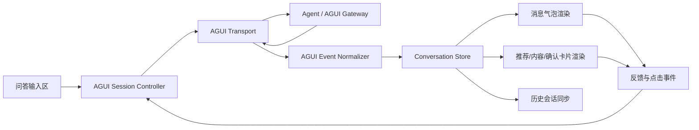

# 前端 AGUI 接入层技术实施方案

## 一、方案背景

本方案面向“首问责任平台”当前前端 Demo 的问答工作台，目标是在不推翻现有页面原型的前提下，为前端补齐一层可落地的 AGUI 接入层，使当前本地模拟问答链路升级为“协议驱动、流式输出、状态可同步、反馈可回流”的真实联调链路。

当前仓库已具备较完整的问答展示雏形：

- `index.html` 中已有问答工作台、历史会话区、详情侧栏和输入区。
- `assets/main.js` 中已有提问入口、会话状态、本地问答渲染、推荐卡片渲染、内容卡片渲染、确认卡片渲染、点赞点踩反馈。
- `assets/main.css` 中已有消息气泡、线程卡片、横向卡片组、详情区等样式基础。

当前问题也很明确：现有问答结果由前端本地函数 `runCurrentQuestion() -> matchQuestion() -> renderConversation()` 直接生成，尚未接入真实 Agent，也没有真正的流式事件协议、服务端会话同步和统一埋点机制。因此，前端需要新增一个 AGUI 接入层，专门负责接收 Agent 事件流、管理会话状态、驱动 UI 渲染和回传用户交互事件。

## 二、实施目标

本次 AGUI 接入层建设，前端侧需要完成以下六类能力：

1. 接入 AGUI 协议。
2. 对接 Agent 流式输出。
3. 渲染问答消息卡片。
4. 渲染推荐卡片、内容卡片、确认卡片。
5. 实现会话状态同步。
6. 实现反馈事件上报。

对应的落地目标不是“再写一套聊天页面”，而是把当前 Demo 中的本地模拟逻辑替换为标准化协议层，尽量复用现有 DOM 结构、样式类名和交互路径。

## 三、当前前端现状评估

### 3.1 页面基础已具备

当前问答页已有以下结构：

- 左侧历史会话列表。
- 中间问答主线程。
- 底部输入框与发送按钮。
- 右侧详情栏，用于展开人员、内容或待确认动作。

这意味着 AGUI 接入层不需要重新定义页面布局，重点是替换数据来源和渲染驱动方式。

### 3.2 当前状态模型已具备雏形

`assets/main.js` 中已存在如下前端状态：

- `state.sessions`：本地会话集合。
- `state.activeSessionId`：当前会话 ID。
- `state.conversation`：当前会话的轮次数据。
- `state.pendingAction`：待确认动作。
- `state.lastResult`：最新一次问答结果。
- `state.feedback`：点赞点踩反馈。

这说明现有代码已经有“会话态”“问答态”“确认态”“反馈态”的基本分层，适合继续演进为协议驱动状态机，而不是推翻重写。

### 3.3 当前问答链路是本地同步计算

当前主链路为：

1. 用户输入问题。
2. `runCurrentQuestion()` 读取输入并展示 loading。
3. `matchQuestion()` 本地计算问题解析、内容命中、人员匹配和动作类型。
4. `renderConversation()` 将结果整体渲染为一轮对话。

这一模式的局限是：

- 无法承接真实 Agent 的 token 流输出。
- 无法逐步插入卡片。
- 无法表达“模型先说一句，再返回推荐列表，再发确认卡片”的多阶段事件。
- 无法把前端交互动作作为事件继续送回 Agent。

所以 AGUI 接入层必须从“一次性结果渲染”改为“事件流驱动的增量渲染”。

## 四、AGUI 接入层目标架构

建议前端新增一层薄接入架构，位于“页面渲染层”和“后端 Agent 服务”之间。



建议拆成五个前端职责模块：

- `AGUI Transport`：负责发起请求、建立流式连接、接收事件。
- `AGUI Event Normalizer`：把后端 AGUI 原始事件转换为前端统一事件。
- `Conversation Store`：维护当前会话、消息列表、卡片列表、流式状态、待确认状态。
- `Renderer`：基于 Store 渲染消息和卡片。
- `Interaction Reporter`：把点赞、点踩、卡片点击、确认、取消等操作上报给后端。

## 五、前端模块拆分设计

建议在当前静态项目中先按文件内模块拆分，再视情况抽成独立文件。第一阶段即使仍保留单文件，也应在逻辑上拆成以下区域。

### 5.1 Session Controller

职责：

- 创建会话。
- 切换会话。
- 发送用户消息。
- 维护当前会话是否正在流式响应。
- 控制中断、重试、继续追问。

建议新增接口：

- `createAguiSession()`
- `sendUserMessage(sessionId, messageText, context)`
- `resumeSession(sessionId)`
- `abortSession(sessionId)`
- `syncSessionSnapshot(sessionId)`

### 5.2 Transport 层

职责：

- 与 AGUI 网关建立通信。
- 支持 `fetch + ReadableStream` 或 SSE。
- 在断流、超时、网络异常时给出统一错误事件。

建议优先采用：

- 请求发送：`POST /api/agui/sessions/{sessionId}/messages`
- 响应模式：`text/event-stream` 或基于 `fetch` 的 chunked stream

原因：

- 当前项目是浏览器静态页，SSE 和 fetch stream 接入成本最低。
- 问答流通常是服务端单向推送，优先不引入 WebSocket 复杂度。

### 5.3 Event Normalizer

职责：

- 将 AGUI 原始协议事件转成前端固定格式。
- 屏蔽后端字段差异。
- 保证渲染层只消费统一结构。

建议统一后的前端事件类型如下：

- `message_start`
- `message_delta`
- `message_end`
- `card_recommendation`
- `card_content`
- `card_confirmation`
- `session_patch`
- `feedback_ack`
- `error`
- `done`

### 5.4 Conversation Store

职责：

- 存放当前线程消息。
- 存放卡片节点。
- 记录流式中的消息草稿。
- 记录推荐卡片是否已反馈、确认卡片是否已确认。
- 记录会话元数据，例如标题、最后更新时间、摘要、状态。

建议数据结构如下：

```js
const aguiSessionState = {
  sessionId: "",
  title: "",
  status: "idle", // idle | streaming | waiting_confirm | error | done
  messages: [
    {
      id: "",
      role: "user", // user | assistant | system
      text: "",
      streaming: false,
      createdAt: ""
    }
  ],
  cards: [
    {
      id: "",
      kind: "recommendation", // recommendation | content | confirmation
      anchorMessageId: "",
      payload: {},
      status: "active"
    }
  ],
  pendingConfirm: null,
  feedbackMap: {},
  meta: {
    lastEventId: "",
    updatedAt: "",
    summary: ""
  }
};
```

### 5.5 Renderer

职责：

- 把 `messages` 渲染为消息气泡。
- 把 `cards` 渲染为推荐卡片、内容卡片、确认卡片。
- 在流式过程中对 assistant 消息进行增量刷新。

渲染原则：

- assistant 文本消息与卡片分开存储，但在展示上挂靠到同一轮消息下方。
- 同一轮内允许先出现消息文本，再追加卡片。
- 卡片点击、确认、反馈不直接改 DOM，而是先写 Store，再统一重渲染。

## 六、AGUI 协议接入设计

## 6.1 建议的前后端交互方式

前端发送：

```http
POST /api/agui/sessions/{sessionId}/messages
Content-Type: application/json
Accept: text/event-stream
```

请求体建议：

```json
{
  "message": {
    "id": "msg_u_20260707_001",
    "role": "user",
    "text": "我想申请大模型 Key，应该找谁"
  },
  "context": {
    "userId": "p-lin",
    "page": "ask",
    "clientTraceId": "trace_xxx"
  }
}
```

服务端返回事件流建议遵循“文本输出 + 结构化卡片 + 会话补丁”的组合模式。

### 6.2 建议的 AGUI 事件格式

建议前端要求后端至少输出以下字段：

```json
{
  "event": "message_delta",
  "sessionId": "session_001",
  "messageId": "msg_a_001",
  "timestamp": "2026-07-07T10:00:00+08:00",
  "data": {
    "delta": "好的，我先帮你定位相关负责人。"
  }
}
```

推荐卡片事件示例：

```json
{
  "event": "card_recommendation",
  "sessionId": "session_001",
  "messageId": "msg_a_001",
  "data": {
    "cards": [
      {
        "id": "rec_001",
        "personId": "p-chen",
        "name": "陈亦舟",
        "department": "数字能力中心",
        "role": "大模型平台主管",
        "contact": "13800001201",
        "tags": ["大模型", "Key 申请", "模型调用"],
        "reasons": ["负责领域命中“大模型”", "关联内容命中“大模型 Key 申请流程”"],
        "relatedContentIds": ["c-key", "c-agent"],
        "rankLabel": "首推"
      }
    ]
  }
}
```

确认卡片事件示例：

```json
{
  "event": "card_confirmation",
  "sessionId": "session_001",
  "messageId": "msg_a_002",
  "data": {
    "id": "confirm_profile_001",
    "actionType": "profile_update",
    "title": "检测到资料维护需求",
    "description": "我已识别到你要维护个人资料，可以直接确认更新或去个人中心手动编辑。",
    "changes": ["联系方式将更新为 13800001234"],
    "confirmAction": {
      "code": "confirm_profile_update",
      "payload": {
        "contact": "13800001234"
      }
    }
  }
}
```

### 6.3 事件顺序约定

建议约定以下顺序：

1. `message_start`
2. 多次 `message_delta`
3. 可选多个 `card_*`
4. 可选 `session_patch`
5. `message_end`
6. `done`

这样前端可以稳定支持以下展示效果：

- 先流式显示一句回答。
- 再展示推荐卡片。
- 再追加内容卡片。
- 如果是操作类任务，再给确认卡片。

## 七、流式输出渲染设计

### 7.1 从整轮渲染改为增量渲染

当前 `renderConversation()` 是按整轮一次性拼接 HTML。接入 AGUI 后，建议改成以下策略：

1. 用户发问后，立即插入一条 user 消息。
2. 同时插入一条空的 assistant 消息草稿，状态为 `streaming=true`。
3. 每收到 `message_delta`，把文本追加到该 assistant 消息。
4. 每收到 `card_*` 事件，追加到当前 assistant 消息对应的卡片区。
5. 收到 `message_end` 后，将 assistant 消息设为 `streaming=false`。

### 7.2 增量更新伪代码

```js
function applyAguiEvent(event) {
  switch (event.type) {
    case "message_start":
      store.startAssistantMessage(event.messageId);
      break;
    case "message_delta":
      store.appendAssistantText(event.messageId, event.delta);
      break;
    case "card_recommendation":
      store.appendCards(event.messageId, "recommendation", event.cards);
      break;
    case "card_content":
      store.appendCards(event.messageId, "content", event.cards);
      break;
    case "card_confirmation":
      store.appendCards(event.messageId, "confirmation", [event.card]);
      store.setPendingConfirm(event.card);
      break;
    case "session_patch":
      store.patchSessionMeta(event.patch);
      break;
    case "message_end":
      store.finishAssistantMessage(event.messageId);
      break;
    case "error":
      store.markError(event.error);
      break;
    case "done":
      store.finishStream();
      break;
  }
  renderConversation();
  renderConversationHistory();
}
```

### 7.3 流式体验要求

- 单次文本增量刷新节流到 `30ms ~ 80ms`，避免频繁重排。
- 卡片事件一到即渲染，不必等文本结束。
- 用户切换会话时，若旧会话仍在流式中，前端应保留其状态，不应丢失。

## 八、卡片渲染方案

当前 Demo 已有三类卡片雏形，建议直接沿用现有视觉结构，只替换数据来源和交互语义。

### 8.1 问答消息卡片

对应对象：assistant 文本回复。

展示内容：

- 角色标识，例如“首问助手”。
- 文本正文。
- 反馈按钮。
- 命中标签，可选。

与当前代码的映射关系：

- 可复用当前 `assistant-bubble` 的样式结构。
- `renderFeedbackButtons()` 可保留，但事件处理要改为上报后端。

### 8.2 推荐卡片

对应对象：找人类结果。

展示字段建议：

- 人员姓名。
- 部门路径。
- 角色。
- 负责领域标签。
- 推荐理由列表。
- 联系方式。
- 关联内容按钮。
- “查看主页”“继续追问”“有帮助/没帮助”操作。

前端要求：

- 同一轮可渲染 1 到 3 张推荐卡片。
- 需支持 `rankLabel`，例如“首推”“可协助”“相关人员”。
- 点击“查看主页”既要打开本地详情面板，也要上报点击事件。

### 8.3 内容卡片

对应对象：内容查询或推荐依据内容。

展示字段建议：

- 标题。
- 类型。
- 标签。
- 摘要。
- 发布人。
- 发布时间。
- 是否置顶。

交互要求：

- 点击标题或卡片进入详情。
- 可区分“作为推荐依据的内容”与“纯内容查询结果”。

### 8.4 确认卡片

对应对象：资料修改、发布内容、评价草稿等待确认动作。

展示字段建议：

- 卡片标题。
- 动作说明。
- 本次变更摘要。
- 确认按钮。
- 取消按钮。
- 转人工编辑按钮。

交互要求：

- 点击确认后，不直接本地落数据，而是发送 `confirm_action` 事件到服务端。
- 服务端确认成功后，再由 `session_patch` 或新的 assistant 事件回写最终状态。

## 九、会话状态同步设计

### 9.1 同步目标

当前本地会话只存在 `localStorage` 中。接入 AGUI 后，会话必须具备“前端可恢复、后端可追踪、历史可重放”的能力。

建议同步以下内容：

- `sessionId`
- 标题
- 最后活跃时间
- 消息摘要
- 最近一轮消息状态
- 当前是否有待确认动作
- 当前是否在流式中

### 9.2 同步策略

建议采用“双层同步”：

- 前端内存态：保证当前页面交互实时响应。
- 本地缓存态：用于刷新恢复。
- 服务端会话态：用于跨端追踪、历史回放和真实业务落库。

建议时机：

1. 新建会话后立即同步一次。
2. 收到 `message_end` 后同步一次完整快照。
3. 收到 `session_patch` 后增量同步。
4. 用户执行确认、反馈、点击卡片等关键动作后同步。

### 9.3 会话列表接口建议

- `POST /api/agui/sessions`
- `GET /api/agui/sessions`
- `GET /api/agui/sessions/{sessionId}`
- `GET /api/agui/sessions/{sessionId}/messages`
- `PATCH /api/agui/sessions/{sessionId}`

### 9.4 前端会话恢复逻辑

页面初始化时：

1. 先读本地缓存，快速渲染历史列表。
2. 再调用服务端会话列表接口做一次校准。
3. 若发现某会话处于 `streaming` 状态，则展示“处理中”标识。
4. 用户进入会话时，再拉取该会话完整消息快照。

## 十、反馈事件上报设计

### 10.1 需要上报的反馈事件

本项目不是普通聊天机器人，反馈数据会直接影响后续推荐优化，因此前端必须把行为事件结构化上报。

建议上报事件包括：

- 对回答点赞。
- 对回答点踩。
- 对推荐卡片点赞。
- 点击推荐卡片查看主页。
- 点击关联内容。
- 点击确认卡片“确认”。
- 点击确认卡片“取消”。
- 点击“继续追问”。
- 会话中断。

### 10.2 上报事件结构

```json
{
  "sessionId": "session_001",
  "messageId": "msg_a_001",
  "eventType": "recommendation_click",
  "targetType": "person_card",
  "targetId": "p-chen",
  "value": "view_profile",
  "context": {
    "rank": 1,
    "source": "ask"
  },
  "timestamp": "2026-07-07T10:05:00+08:00"
}
```

### 10.3 上报接口建议

建议统一提供：

- `POST /api/agui/events`

这样前端无需按“点赞接口”“点击接口”“确认接口”拆很多条线，统一按事件总线方式回传即可。对于需要真正落业务动作的确认类事件，可由后端再按 `eventType` 转发到实际业务服务。

### 10.4 前端处理原则

- 上报动作默认异步，不阻塞主渲染。
- 关键动作如“确认提交”需要等待服务端确认结果。
- 普通行为埋点失败时，只记录本地告警，不影响用户继续使用。

## 十一、与当前代码的改造映射

建议按“最小侵入”方式改造现有 `assets/main.js`。

### 11.1 需要保留的部分

- 页面结构与 DOM 节点 ID。
- 当前消息气泡和卡片样式。
- 历史会话列表 UI。
- 详情侧栏 UI。

### 11.2 需要替换的部分

1. 用 `sendUserMessage()` 替代当前 `runCurrentQuestion()` 中的本地 `matchQuestion()` 调用。
2. 用 `applyAguiEvent()` 替代“一次性得到 result 后整体渲染”的方式。
3. 用服务端会话数据替代当前 `state.sessions` 的纯本地模式。
4. 用统一事件上报替代当前 `toggleFeedback()` 的纯本地存储模式。

### 11.3 需要新增的核心函数

- `sendUserMessage()`
- `consumeAguiStream()`
- `normalizeAguiEvent()`
- `applyAguiEvent()`
- `appendAssistantDraftMessage()`
- `appendStructuredCard()`
- `reportInteractionEvent()`
- `syncSessionSnapshot()`

## 十二、实施步骤

### 第一阶段：接入骨架搭建

目标：先跑通“发消息 -> 收到流 -> 渲染文本消息”。

任务：

- 定义前端统一事件模型。
- 封装流式请求函数。
- 为当前会话增加 `streaming` 状态。
- 实现 assistant 文本的增量渲染。

验收标准：

- 用户发送问题后，assistant 回复可以逐字或逐段流式出现。
- 刷新页面后，历史会话仍可恢复。

### 第二阶段：结构化卡片接入

目标：让推荐卡片、内容卡片、确认卡片都改为协议驱动。

任务：

- 新增三类 `card_*` 事件处理器。
- 改造现有卡片渲染函数，使其接收统一 payload。
- 实现卡片与消息的挂靠关系。

验收标准：

- Agent 可在同一轮消息下动态插入推荐卡片、内容卡片和确认卡片。
- 卡片切换会话后仍能正确还原。

### 第三阶段：会话同步与历史恢复

目标：把当前纯前端会话改为“前端缓存 + 服务端快照”双写模式。

任务：

- 接入会话创建、列表、详情接口。
- 增加会话快照同步逻辑。
- 支持刷新恢复和会话重放。

验收标准：

- 用户刷新页面后，历史会话内容、卡片状态、待确认状态不丢失。
- 历史会话切换后内容一致，不出现串会话。

### 第四阶段：反馈与行为事件回流

目标：把问答反馈和卡片交互真正沉淀到后端。

任务：

- 接入统一事件上报接口。
- 改造点赞点踩、查看主页、点击内容、确认提交等事件。
- 为后端补齐 traceId、sessionId、messageId 透传。

验收标准：

- 关键交互都有可追踪事件。
- 后端可按会话、消息、推荐对象统计反馈情况。

## 十三、接口联调重点

前后端联调时，建议优先确认以下问题：

1. 每个事件是否都有稳定的 `sessionId`、`messageId`、`event` 字段。
2. 卡片事件是整卡返回还是增量 patch 返回。
3. 推荐卡片中的人员 ID、内容 ID 是否可直接映射现有详情页。
4. 确认卡片的提交结果，是直接回动作成功事件，还是重新走一轮 assistant 回复。
5. 流中断、超时、权限失败时，后端返回什么错误事件。

如果这些约定不先统一，前端很容易出现“能接流，但卡片和状态不稳定”的问题。

## 十四、风险与处理建议

### 风险一：后端事件格式不稳定

处理建议：

- 前端必须增加 `normalizeAguiEvent()`。
- 渲染层绝不直接依赖后端原始字段。

### 风险二：流式文本与结构化卡片顺序混乱

处理建议：

- 强制要求卡片带 `anchorMessageId` 或 `messageId`。
- 前端按消息锚点组织卡片，不按“最新一条消息”猜测归属。

### 风险三：会话刷新后状态丢失

处理建议：

- 会话关键状态必须服务端落快照。
- 本地缓存只做加速，不做唯一数据源。

### 风险四：确认卡片被前端本地提前提交

处理建议：

- 所有确认动作都由服务端最终确认。
- 前端只负责展示“提交中”“已确认”“提交失败”状态。

### 风险五：反馈埋点太散，后续无法分析

处理建议：

- 从第一版开始统一走 `/api/agui/events`。
- 事件模型一次性定清，避免后续多套口径并存。

## 十五、最终交付物建议

本次前端 AGUI 接入层实施，建议交付以下内容：

1. AGUI 接入层代码。
2. 前端统一事件模型文档。
3. 会话状态模型文档。
4. 问答流式联调说明。
5. 推荐卡片、内容卡片、确认卡片 payload 规范。
6. 反馈与埋点事件字典。

## 十六、结论

对于当前“首问责任平台”前端 Demo 来说，AGUI 接入层不是额外加一个聊天 SDK，而是把现有本地问答逻辑正式升级为“事件流驱动的会话 UI 层”。这层建好后，前端才能稳定承接真实 Agent 的流式输出、结构化推荐、确认动作和反馈回流。

从当前仓库基础看，这项工作是适合渐进式改造的：页面结构、卡片形态、会话 UI 和反馈入口都已经具备，最核心的改造点是把 `assets/main.js` 现有的本地同步问答逻辑，替换为“AGUI Transport + Event Normalizer + Conversation Store + Renderer + Interaction Reporter”这一条新链路。这样既能保住当前 Demo 的可视化成果，也能让后续 Agent 联调、推荐闭环和运营数据沉淀顺利接上。
